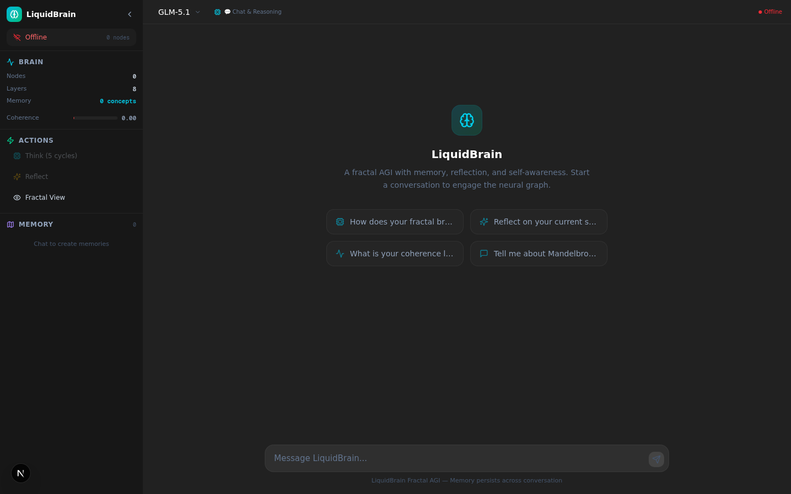
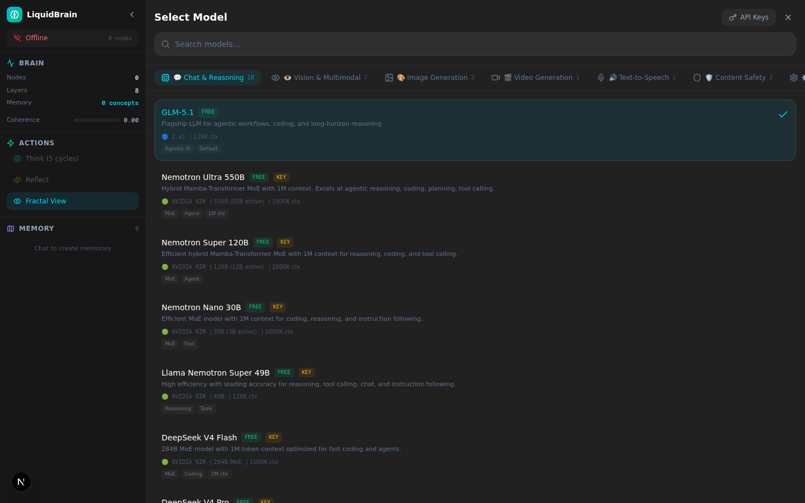
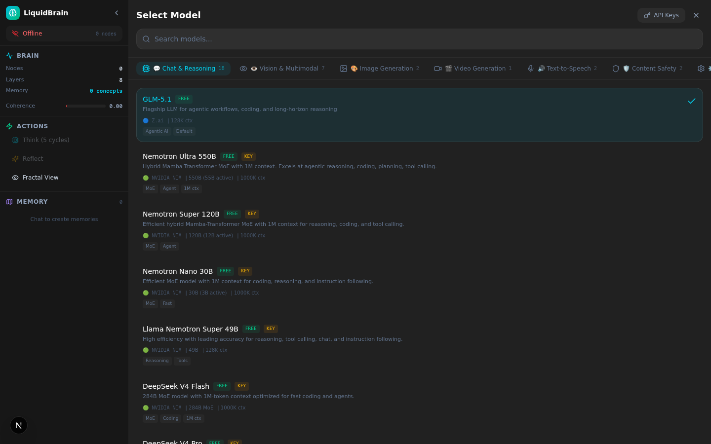
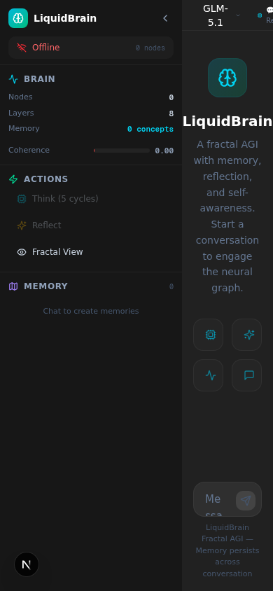
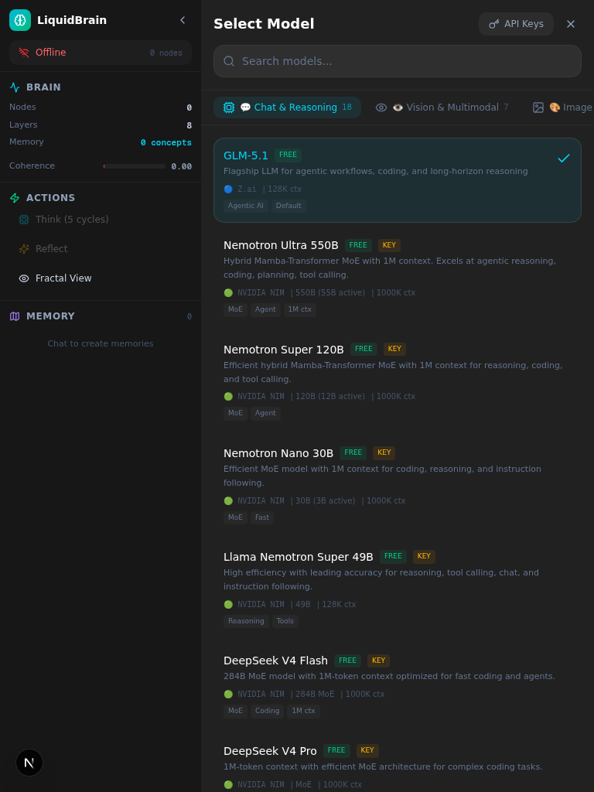

# 🧠 LIQUIDBRAIN — Fractal AGI Engine


**Real-time AGI dashboard for the LiquidBrain Fractal Engine.**  
Perception → Cognition → Memory → Action → Reflection.

---

## 🖼️ Screenshots

### Desktop Dashboard


### Fractal Visualization
The Mandelbrot set comes alive as a neural graph — each fractal node represents a cognitive unit that activates, connects, and rewires in real-time.



### Model Selector
Switch between AI models from NVIDIA NIM, MiniMax, Z-AI, and more. Each model passes through the FractalBrain cognitive pipeline before generating responses.



### Mobile Responsive
The dashboard adapts seamlessly to mobile and tablet viewports.



### Tablet View


---

## 🚀 Features

### Fractal Cognition Pipeline
`POST /api/agi/chat` runs the pipeline in this order (see `src/lib/agi/pipeline.ts`):
1. **PERCEIVE** — the message is embedded into the complex plane by the engine
2. **RECALL** — salient concepts are retrieved and rendered into the prompt
3. **STATE** — coherence + last insight are read from the meta-cognition layer
4. **GENERATE** — the selected LLM answers, with the last 10 stored turns replayed
5. **PERSIST** — both turns are written to SQLite when it is configured
6. **THINK** — 3 background cycles are queued (fire-and-forget, never blocks the reply)

**REFLECT** (self-evaluation + rewiring) stays an explicit user action, in the sidebar
or the reflection bar.

Steps 1–3 and 6 are no-ops when `FRACTALBRAIN_URL` is unreachable: the LLM still answers.

### Multi-Model Support
Route requests to different AI providers through a unified cognitive layer:

| Provider | Models | Capabilities |
|----------|--------|-------------|
| **Z-AI** | GLM-5.1 (default) | Chat, reasoning, coding, agentic — needs `.z-ai-config` or `ZAI_API_KEY`/`ZAI_BASE_URL` |
| **NVIDIA NIM** | 34 entries: Nemotron Ultra/Super/Nano, DeepSeek, Kimi, Qwen, Llama 3.3/4, MiniMax M3/M2.7, FLUX.1, SD 3.5, Cosmos3, Magpie TTS, Llama Guard… | Chat, vision, image generation, TTS, safety |
| **MiniMax** | direct `api.minimax.chat` client (no registry model uses it yet) | Chat |

The registry (`src/lib/models/registry.ts`) is the single source of truth — `GET /api/agi/models`
exposes it, and `src/lib/models/registry.test.ts` asserts that ids, categories and key names stay coherent.

### Real-Time Fractal Visualization
- Mandelbrot set rendered as the neural substrate
- Active nodes pulse and connect in real-time
- Memory concepts positioned in the complex plane
- Coherence monitoring via visual feedback

### Memory Map
- Interactive concept cloud visualization
- Concept positions derived from fractal embeddings
- Salience-based size and color coding
- Hover to inspect individual memory traces

### Capabilities
- 💬 **Chat** — Conversational AI with fractal context enrichment
- 👁️ **Vision** — Image understanding and analysis (URL-based)
- 🎨 **Image Generation** — AI-powered image creation
- 🔊 **Text-to-Speech** — Natural voice synthesis
- 🛡️ **Safety** — Content moderation and safety checks
- 🧠 **Think** — Trigger fractal neural cycles manually
- 🪞 **Reflect** — Meta-cognitive self-assessment
- 🏋️ **Train** — Online learning with custom text (Brain Console)
- 🎞️ **Video** — model selection is wired, generation is still a stub in the UI

---

## 🏗️ Architecture

```
┌────────────────────────────────────────────┐
│ Frontend                                   │
│ Next.js 16 + React 19 + Tailwind CSS 4     │
│ FractalSNN · MemoryMap · ModelSelector     │
│ ControlPanel · ReflectionBar · Sequencer   │
└────────────────────────────────────────────┘
                      │  /api/agi/*
┌────────────────────────────────────────────┐
│ Next.js API Routes (14)                    │
│ chat (SSE or JSON) · history · keys        │
│ vision · image · tts · safety · models     │
│ perceive · think · reflect · state         │
│ memory · train                             │
│  ↓ each one: guard() — origin, throttle,   │
│    body cap; keys resolved from the session│
└────────────────────────────────────────────┘
                      │
┌──────────────────┐ ┌──────────────────┐ ┌──────────────────┐
│ FractalBrain     │ │ SQLite + Prisma  │ │ AI providers     │
│ engine contract: │ │ ChatTurn history │ │ Z-AI SDK         │
│ contracts/*.json │ │ best-effort:     │ │ NVIDIA NIM       │
│ + runnable mock  │ │ no DB → chats    │ │ MiniMax          │
│ FRACTALBRAIN_URL │ │ are ephemeral    │ │ streamed via SSE │
│ (optional)       │ │                  │ │ per-model choice │
└──────────────────┘ └──────────────────┘ └──────────────────┘
```

### Tech Stack

- **Frontend**: Next.js 16, React 19, Tailwind CSS 4, 7 vendored shadcn/ui primitives, Zustand
- **Backend**: Next.js API Routes (App Router), Z-AI Web Dev SDK, Prisma + SQLite (chat history),
  dependency-free engine mock (`mini-services/brain-mock`) and an OpenAPI 3.1 contract (`contracts/`)
- **Streaming**: `text/event-stream` from provider to browser, no extra framework
- **AI Providers**: Z-AI, NVIDIA NIM, MiniMax
- **FractalBrain**: Rust-based cognitive engine (external service)
- **State Management**: Zustand for client state
- **Canvas Rendering**: HTML5 Canvas for Mandelbrot & Memory Map

---

## 📁 Project Structure

```
src/
├── app/
│   ├── api/agi/
│   │   ├── chat/route.ts       # Chat: perceive → recall → state → generate → persist
│   │   ├── history/route.ts    # GET/DELETE stored conversation (SQLite, optional)
│   │   ├── vision/route.ts     # Vision analysis
│   │   ├── image/route.ts      # Image generation
│   │   ├── tts/route.ts        # Text-to-speech
│   │   ├── safety/route.ts     # Content safety
│   │   ├── perceive/route.ts   # Perception proxy
│   │   ├── think/route.ts      # Think cycles proxy
│   │   ├── reflect/route.ts    # Reflection proxy
│   │   ├── state/route.ts      # Brain state proxy
│   │   ├── memory/route.ts     # Memory retrieval proxy
│   │   ├── models/route.ts     # Model registry
│   │   ├── keys/route.ts       # API key custody: GET masks / POST store / DELETE forget
│   │   └── train/route.ts      # Online training
│   ├── globals.css
│   ├── layout.tsx              # Self-hosted Geist fonts (no Google Fonts at build time)
│   └── page.tsx                # Main AGI dashboard
├── components/
│   ├── agi/
│   │   ├── FractalSNN.tsx      # Mandelbrot neural visualization
│   │   ├── MemoryMap.tsx       # Interactive concept cloud
│   │   ├── ModelSelector.tsx   # Multi-model picker + provider keys
│   │   ├── ControlPanel.tsx    # Brain console: metrics, actions, training
│   │   ├── ReflectionBar.tsx   # Coherence / surprise / confidence / insight bar
│   │   └── Sequencer.tsx       # Perceive → think step sequencer
│   └── ui/                     # shadcn/ui primitives (vendored)
├── hooks/
│   ├── use-mobile.ts
│   └── use-toast.ts
├── server/                     # server-only modules (never imported by a client component)
│   ├── session.ts              # session cookie: read / mint / serialise
│   ├── keys.ts                 # in-memory per-session key custody + masking
│   └── guard.ts                # origin check, throttle, size-capped body parse
└── lib/
    ├── agi/
    │   ├── backend.ts          # FRACTALBRAIN_URL, timeouts, callBackend()
    │   ├── pipeline.ts         # perceive → recall → state context builder
    │   ├── history.ts          # Prisma chat persistence (graceful fallback)
    │   ├── types.ts            # Shared client/server types (backend contract)
    │   ├── api.ts              # Client API wrapper (incl. chatStream)
    │   ├── sse.ts              # Incremental SSE frame parser (tested)
    │   └── store.ts            # Zustand state store
    ├── models/
    │   ├── registry.ts         # Model definitions & categories
    │   └── providers.ts        # Provider-specific API clients
    ├── db.ts
    └── utils.ts

contracts/
├── fractalbrain.openapi.json   # the engine's HTTP shape (OpenAPI 3.1, 7 endpoints)
├── contract.test.ts            # contract ⇄ types ⇄ mock conformance
└── lib/json-schema-lite.mjs    # validator subset, no dependencies
mini-services/brain-mock/       # runnable reference engine (dev, CI, demos)
```


---

## ⚡ Getting Started

### Prerequisites
- Node.js 20+ (`package-lock.json` is the lock of record; `bun install` also works and writes its own lock)
- A FractalBrain engine on `http://127.0.0.1:8080` — **optional at two levels**: without any engine the
  dashboard runs in LLM-only mode (chat works, Think/Reflect/Train/Memory report "offline"), and
  `npm run mock:brain` starts the dependency-free reference engine so the fractal side is fully live
  without the Rust service.

### Installation

```bash
# Clone the repository
git clone https://github.com/AFKmoney/LiquidBrain.git
cd LiquidBrain

# Install dependencies (also prepares the Prisma client)
npm ci             # or: bun install

# Optional: the reference engine — real memory, think, reflect and train numbers
npm run mock:brain # http://127.0.0.1:8080

# Start the development server
npm run dev
```

Open [http://localhost:3000](http://localhost:3000) to see the dashboard. With the mock running, the
sidebar shows "online", perceived ideas appear as labelled points inside the fractal window, and
Think / Reflect / Train return computed numbers instead of the offline defaults.

> **Lockfile note:** `package-lock.json` is committed and used by CI. The stale `bun.lock` that
> shipped from the template (it predates the `geist` dependency) was removed; `bun install`
> regenerates one locally, which is git-ignored.

### Environment Variables

Copy `.env.example` to `.env` and adjust. `.env` is git-ignored; only `.env.example` is committed.

| Variable | Required | Purpose |
|--------|----------|---------|
| `FRACTALBRAIN_URL` | no | Base URL of the FractalBrain engine. Defaults to `http://127.0.0.1:8080`. Every `/api/agi/{state,memory,perceive,think,reflect,train}` proxy reads it. |
| `DATABASE_URL` | no | SQLite file for chat persistence, resolved **relative to `prisma/`** (`file:../db/custom.db` → `db/custom.db`). Leave unset (or skip `prisma generate`) and the app simply keeps chats in memory for the current page session. |
| `NVIDIA_API_KEY` | for NVIDIA models | NVIDIA NIM chat / image / TTS / safety. Can also be pasted in the in-app settings panel, where it is held by the server for your session only. |
| `MINIMAX_API_KEY` | for MiniMax models | MiniMax chat. Also settable in the UI (session-scoped). |
| `ZAI_API_KEY` + `ZAI_BASE_URL` | optional | Lets the Z-AI provider use an OpenAI-compatible endpoint instead of a config file. |

**Z-AI (the default `GLM-5.1` model)** is reached through `z-ai-web-dev-sdk`, which reads
`{ "baseUrl": "...", "apiKey": "..." }` from a `.z-ai-config` JSON file in the project root,
`~/.z-ai-config`, or `/etc/.z-ai-config`. Without that file (and without `ZAI_API_KEY`/`ZAI_BASE_URL`)
`POST /api/agi/chat` answers `502` with an explicit "Z-AI is not configured …" message — pick another
provider in the model selector instead. The file is git-ignored on purpose.

---

## 🧪 Usage

1. **Chat**: Type a message to interact with LiquidBrain. The cognitive pipeline enriches every response with fractal context, and the last 10 stored turns are replayed to the model so the conversation keeps its thread.
2. **Switch Models**: Click the model badge (e.g., "GLM-5.1") to open the model selector and choose from NVIDIA, MiniMax, or Z-AI models. The choice is remembered across reloads.
3. **Brain Console**: the "Brain Console" button (sidebar) opens live engine metrics plus Think / Reflect / Sync, the **Train** box and the **Sequencer** (perceive → think step programs).
4. **Reflect**: Run a self-reflection to assess coherence and potentially rewire connections — the bottom bar shows coherence, surprise, confidence, memory utilization and the latest insight.
5. **Fractal View**: Toggle the Mandelbrot visualization to see the neural substrate in action; concepts that fired during the last think cycle are highlighted.
6. **Streaming**: replies arrive token by token (`/api/agi/chat` with `stream: true`); the coherence and
   memory readings update on the first frame, before the answer finishes.
7. **Provider keys**: the "API Keys" panel in the model selector sends them to `POST /api/agi/keys`, which
   keeps them in the server process for this browser session. Nothing is written to `localStorage`, the key
   never appears in a request body again, and the panel only ever shows a mask (`••••••99fe`) plus where the
   effective key came from (your session or the environment). Restart the server and they are gone.
8. **Esc** closes the top-most overlay (model selector → fractal view → console).

---

## 🔒 Security model (and what it deliberately is not)

| Control | Where |
|---|---|
| Provider keys held in memory per session, masked in responses | `src/lib/server/keys.ts`, `/api/agi/keys` |
| `HttpOnly`, `SameSite=Strict`, `Partitioned` session cookie; `Secure` when TLS | `src/lib/server/session.ts` |
| Cross-origin writes rejected (403) | `guard()` in `src/lib/server/guard.ts` |
| Throttles: 12 chat / 6 media / 20 safety / 60 engine calls per minute per client, with `Retry-After` | `LIMITS` in the same file |
| Request bodies capped (64 KB; 6 MB where base64 images arrive) and parsed once | `guard()` |
| Security headers: `nosniff`, `X-Frame-Options: DENY`, `no-referrer`, COOP, `Permissions-Policy`; CSP + HSTS in production | `next.config.ts` |

There is **no authentication**: the dashboard has no accounts, so anyone who can reach the host can chat
with the environment keys and consume that budget. The throttle bounds the blast radius; it does not
replace access control, which is the first thing to add before publishing an instance.

---

## 🗄️ Chat persistence

`/api/agi/chat` writes both turns into SQLite (`ChatTurn`), and `/api/agi/history` serves them back, so the transcript and the model's conversation context survive a reload.

```bash
npm run db:generate   # prisma generate
npm run db:push       # creates db/custom.db tables from prisma/schema.prisma
```

The whole layer is best-effort: if Prisma was not generated or the SQLite file is missing,
`GET /api/agi/history` returns `{ "messages": [], "persisted": false }` and the UI shows
"Ephemeral session" instead of failing.

---

## 🛠️ Development checks

```bash
npm run typecheck   # tsc --noEmit (the build also type-checks now)
npm run lint        # eslint .
npm test            # node --test on src/**/*.test.ts + contracts/**/*.test.ts (type-stripped)
npm run test:contract  # OpenAPI contract ⇄ src/lib/agi/types.ts ⇄ mock only
npm run check       # all three
npx next build      # standalone build, fails on any type error
```

46 tests cover the backend client, the pipeline, the model registry, the SSE parser, the route guard,
key custody, and 7 contract-conformance tests: every endpoint the dashboard proxies must be declared,
nothing declared may go unused, and each response schema must match its TypeScript interface field by
field. `mini-services/brain-mock` is the reference implementation those tests exercise.

### CI

`.github/workflows/ci.yml` runs on pushes to `main`, pull requests and manual dispatch:

1. **verify** — `npm ci` → `typecheck` → `lint` → `test`.
2. **build-and-smoke** — `npm run build`, then boots `.next/standalone/server.js` with the mock engine on
   its own port (`FRACTALBRAIN_URL`) and asserts over HTTP: state is served by the engine, perceive stores
   a concept, think runs the requested cycles, blank training text still answers 400, and killing the
   engine degrades to `503` with `"status":"offline"` instead of a 500.

---

## 📄 License

MIT
